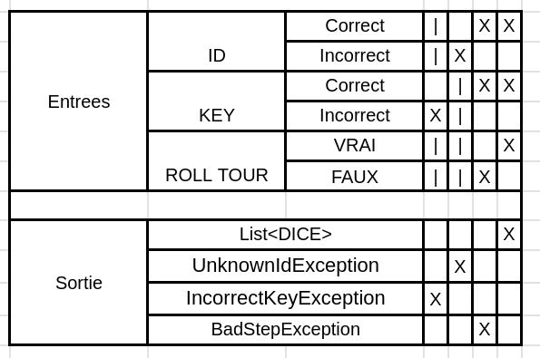
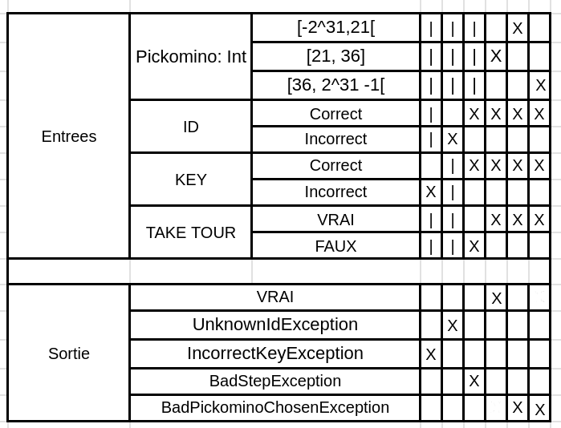
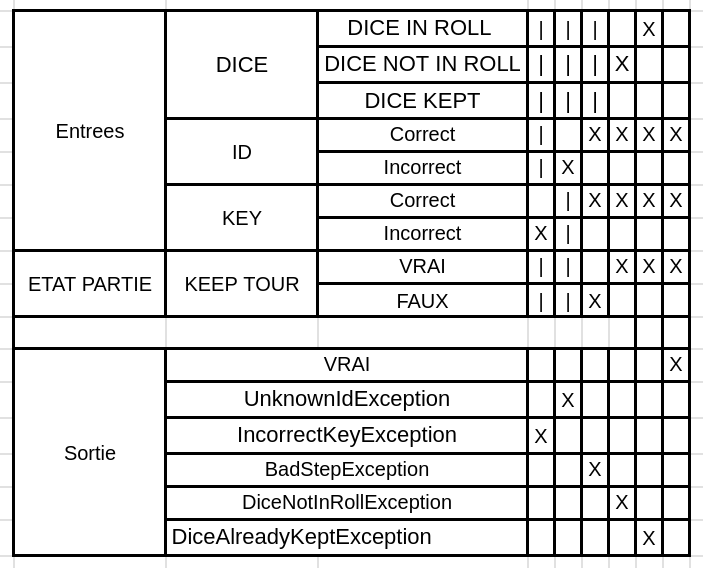
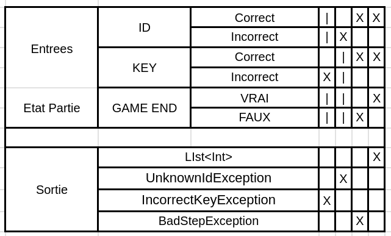

# Compte-rendu

- Point de vigilance
- Conception cas de test

# Points de vigilance et corrections étendus pour la bibliothèque "pickomino-lib"

## 1. Gestion des exceptions

### Points de vigilance:

- Assurez-vous que les exceptions sont non seulement attrapées, mais aussi enregistrées ou signalées d'une manière qui facilite le débogage.

### Corrections et Tests:

- Utiliser un mécanisme de journalisation pour enregistrer les détails des exceptions.
- Considérer l'utilisation de métriques pour suivre la fréquence des exceptions qui sont lancées.

## 2. Vérification des identifiants de partie et des clés

### Points de vigilance:

- Assurez-vous que les identifiants de partie et les clés sont stockés et gérés de manière sécurisée.

### Corrections et Tests:

- Envisagez d'utiliser un gestionnaire de clés ou un stockage sécurisé pour les identifiants et clés.

## 3. Validation des paramètres d'entrée

### Points de vigilance:

- Veillez à ce que l'application ne soit pas vulnérable aux attaques d'injection par le biais de paramètres d'entrée malveillants.

### Corrections et Tests:

- Sanitiser les entrées pour prévenir les attaques d'injection.
- Ajouter des tests qui tentent d'exploiter les vulnérabilités d'injection.

## 4. Vérification de l'état du jeu

### Points de vigilance:

- S'assurer que le jeu gère correctement les situations de concurrence, où plusieurs joueurs tentent d'effectuer des actions en même temps.

### Corrections et Tests:

- Implémenter des mécanismes de verrouillage ou de synchronisation pour gérer la concurrence.
- Ajouter des tests de concurrence pour s'assurer que le jeu se comporte correctement lorsque plusieurs actions sont effectuées simultanément.

## 5. Vérification des valeurs de retour

### Points de vigilance:

- Vérifier que les valeurs de retour sont du type de données attendu.

### Corrections et Tests:

- Ajouter des tests qui vérifient le type de données des valeurs de retour.

## 6. Vérification de l'application des règles du jeu

### Points de vigilance:

- Assurez-vous que les règles du jeu sont appliquées de manière cohérente et correcte pour tous les joueurs.
- Vérifiez que les règles du jeu sont clairement définies et correspondent à ce que les joueurs attendent.

### Corrections et Tests:

#### a. Clarté et documentation des règles

- Réviser et clarifier la documentation des règles du jeu pour s'assurer qu'elles sont bien comprises.
- Inclure des exemples pour illustrer l'application des règles dans différentes situations.

#### b. Cohérence des règles

- Vérifier que les règles sont appliquées de la même manière pour tous les joueurs et qu'elles sont consistantes d'une partie à l'autre.
- S'assurer que les conditions de victoire, de défaite et d'égalité sont correctement gérées.

#### c. Tests automatisés pour les règles

- Créer des tests automatisés qui simulent des parties avec des combinaisons de dés prédéterminées et des actions des joueurs.
- Comparer les résultats des tests avec les résultats attendus en fonction des règles documentées.

#### d. Tests de limite

- Effectuer des tests pour vérifier le comportement du jeu lorsque les joueurs atteignent les limites des règles (par exemple, nombre maximal de points, nombre minimal de points, etc.).

#### e. Tests de scénarios spécifiques

- Créer des scénarios de test qui mettent en œuvre des stratégies de jeu spécifiques pour vérifier que les règles sont appliquées correctement.
- Par exemple, si une règle stipule qu'un joueur ne peut pas effectuer une certaine action sous certaines conditions, créer un scénario de test qui tente d'effectuer cette action et vérifier que le jeu empêche correctement cette action.

## 7. Vérification de l'interface

### Points de vigilance:

- Veiller à ce que l'interface soit réactive et s'adapte correctement à différentes tailles d'écran et résolutions.

### Corrections et Tests:

- Effectuer des tests sur différents appareils et résolutions d'écran.
- Mettre en œuvre un design réactif pour s'adapter aux différentes tailles d'écran.

## 8. Gestion de la performance et optimisation

### Points de vigilance:

- Identifier les goulots d'étranglement potentiels dans les performances de l'application.
- S'assurer que le jeu reste réactif même avec un grand nombre de joueurs et des interactions fréquentes avec le serveur.

### Corrections et Tests:

- Utiliser des outils de profilage pour identifier les goulots d'étranglement dans le code.
- Optimiser les requêtes au serveur.
- Effectuer des tests de charge pour évaluer la performance du jeu sous une charge importante.

## 9. Documentation et support pour les développeurs

### Points de vigilance:

- S'assurer de la documentation de votre travail

### Corrections et Tests:

- Créer une documentation complète et bien structurée, incluant des exemples de code et des explications des fonctions.
- Mettre en place un mécanisme de support pour aider les développeurs qui rencontrent des problèmes ou ont des questions sur l'utilisation de la bibliothèque.

# Conception des Tests

## Fonction rollDice

Tableau de décision: 



Nous effectué plusieurs test sur cette fonction : 
La fonction rollExceptionTest(){} Crée une partie qui a pour entrée un id et une key correct (2 premiers tests) et qui vérifie ensuite si on peut roll les dices par la game. Si on peut, le retour de cette fonction est la liste des DICES. Sinon, on a une exeption indiquant qu'on est a la movaise étape du jeu `BadStepException`. Si la clé ou l'ID n'est pas bon le serveur renvoie les erreurs suivantes : `UnknownIdException` pour l'ID ou `IncorrectKeyException` pour la KEY.

La fonction de test ne renvoie pas d'erreurs particulières ou anormales après.

Voici un exemple de la fonction : 

```Kotlin
fun rollExceptionTest(){
        val connect = Connector.factory("172.26.82.76", "8080", true)
        val identification = connect.newGame(2)
        val id = identification.first
        val key = identification.second
        connect.rollDices(id, key)
        assertThrows<iut.info1.pickomino.exceptions.BadStepException> {connect.rollDices(id, key)}
    }
```

## Fonction TakePickomino

Tableau de décision: 



Tout d'abord vous pouvez retrouvez ce test dans le fichier testTurn.kt

Pour cette fonction nous avons 6 tests a effectué:

Nous avons une autre fonction test nommé: takeExceptionKeyTest(){} comme son nom l'indique cela test si l'erreur IncorrectKeyException est bien renvoyé si nous avons donné en entré une mauvaise key et un bon Id, et un Int entre 21 et 36.

Ensuite la fonction qui vérifie l'erreur lié a l'ID: takeExceptionIdTest(){}
testant si l'erreur UnknownIdException est bien renvoyé quand nous donnons une bonne key et un mauvais ID et un Int entre 21 et 36.

On retrouve aussi la fonction takeExceptionTest(){} qui test si on peut utiliser Keep quand c'est pas son tour et cela doit renvoyer l'erreur suivante: BadStepException, pour ce faire on lui donne une key, un ID et un dice correcte.

On a fait une fonction de test pour prendre un pickomino qui vérifie si c'est possible. Nous avons pluseurs fonctions qui testent si le score est sous 21, alors on peut pas et on a l'erreur `BadPickominoChosenExeption`. Si les dés sont en dessous du dernier pickomino dispo (entre ceux des joueurs ou ceux du plateau), le code renvoie la meme exeption. Si on essaye de prendre un pickomino en dessous mais qu'il est dans le jeu d'un joueur (si la valeur est pas exactemet les dés).

```
    @Test
    fun notTakePickoTest(){
        val connect = Connector.factory("172.26.82.76", "8080", true)
        val identification = connect.newGame(4)
        val id = identification.first
        val key = identification.second
        connect.choiceDices(id, key, listOf(DICE.worm,DICE.worm,DICE.worm,DICE.worm,DICE.worm,DICE.worm,DICE.worm, DICE.d1))
        connect.keepDices(id, key, DICE.worm)
        assertFalse(connect.takePickomino(id, key, 20))
    } 
```

## Fonction KeepDice

Tableau de décision: 



Tout d'abord vous pouvez retrouvez ce test dans le fichier testTurn.kt

Pour cette fonction nous avons 6 tests a effectué:

Nous avons une autre fonction test nommé: keepExceptionKeyTest(){} comme son nom l'indique cela test si l'erreur IncorrectKeyException est bien renvoyé si nous avons donné en entré une mauvaise key et un bon Id

Ensuite la fonction qui vérifie l'erreur lié a l'ID: keepExceptionIdTest(){}
testant si l'erreur UnknownIdException est bien renvoyé quand nous donnons une bonne key et un mauvais ID et un DICE.d5 

On retrouve aussi la fonction keepExceptionTest(){} qui test si on peut utiliser Keep quand c'est pas son tour et cela doit renvoyer l'erreur suivante: BadStepException, pour ce faire on lui donne une key, un ID et un dice correcte.

Il nous reste a tester les entrées de dice, il existe 3 types de cas à tester, si le dé n'est pas présent dans le roll, si il a déjà été gardé précédemment et si le dé est bon.

Pour le fait que le dé n'est pas dans le roll on a la fonction keepExceptionNotInRollTest qui prend donc un id et une key correct, et on met le jeu en debug permettant donc de choisir les dés et de mettre un dé qui n'a pas été choisis.

Concernant le test keepTest testant si la fonction renvoie bien true. Nous avons donc donné un bon Id et une bonne Key et un Dice se trouvant dans roll et pas encore gardé, pour être sûr que le dé est dans roll nous utiliserons encore le mode debug.

Pour le dernier test vous verrez aussi le code en dessous, ce test keepExceptionAlreadyKeptTest(){} est sensé renvoyé l'erreur suivante: DiceAlreadyKeptException
Pour cela on lui donne un id correct et une bonne key ensuite en mode debug toujours lance les dées en choississant d'y trouver un DICE.d1 et récupère le DICE.d1 avec la fonction keepDice puis on roll encore en mode debug pour trouver encore un DICE.d1 dans le roll pour tester si la fonction KeepDice() renvoie l'erreur quand on essaye de recupérer le DICE.d1

```
    @Test
    fun keepExceptionAlreadyKeptTest(){
        val connect = Connector.factory("172.26.82.76", "8080", true)
        val identification = connect.newGame(4)
        val id = identification.first
        val key = identification.second
        connect.choiceDices(id, key, listOf(DICE.d1,DICE.d5,DICE.d5,DICE.d5,DICE.d5,DICE.d5,DICE.d5,DICE.d5))
        connect.keepDices(id,key,DICE.d1)
        connect.choiceDices(id, key, listOf(DICE.d1,DICE.d5,DICE.d5,DICE.d5,DICE.d5,DICE.d5,DICE.d5))
        assertThrows<iut.info1.pickomino.exceptions.DiceAlreadyKeptException> {connect.keepDices(id, key, DICE.d1)}
    }
```

## Fonction FinalScore

Tableau de décision: 



Tout d'abord vous pouvez retrouvez ce test dans le fichier testTurn.kt

Nous avons donc 4 tests pour cette fonction.

La fonction finalScoreExceptionTest(){} qui prend en entré un Id correcte, une key correcte mais qui n'a pas l'état de partie END GAME, on attend donc que ce test renvoie l'erreur BadStepException.

Le test cité au dessus a été effectué avant un roll, après un roll, après un keep, après un take pour vérifié si qu'importe l'état l'erreur est bien renvoyé

Nous avons une autre fonction test nommé: fun finalScoreKeyExceptionTest(){} comme son nom l'indique cela test si l'erreur IncorrectKeyException est bien renvoyé si nous avons donné en entré une mauvaise key et un bon Id

Ensuite la fonction qui vérifie l'erreur lié a l'ID:fun finalScoreIdExceptionTest(){}
testant si l'erreur UnknownIdException est bien renvoyé quand nous donnons une bonne key et un mauvais ID

Et il reste la dernière fonction testant que le score final est bien renvoyé lors du ENDGAME nommé finalScoreTest{} qui reçois un bon ID et une bonne Key, et que l'état de la partie est bien égale a END GAME, cela est sensé renvoyé une liste de INT

voici en exemple un parmis les 4 tests au dessus. 

```
    @Test
    fun finalScoreExceptionTest(){
        val connect = Connector.factory("172.26.82.76", "8080", true)
        val identification = connect.newGame(4)
        val id = identification.first
        val key = identification.second
        assertThrows<iut.info1.pickomino.exceptions.BadStepException> {connect.finalScore(id, key)}
    }
```

## Fonction Complémentaire

Nous avons aussi fait beaucoup d'autre test que nous n'avons pas pu détailler.

Nous avons tester les changements de status après roll, keep, take etc. 

Ce test a été effectué pour vérifier car un disfonctionnement de cela pourrait poser des problèmes étant une donnée majeur de la plus part de nos tests.

Vous pouvez retrouver ces tests dans testTurn.kt (ligne 50 jusqu'à la ligne 118)

Nous vérifions aussi l'aspect du jeu concernant la pile de pickomino si le serveur ne cause aucun problème à savoir: 
si notre pile est bien initialisé avec le Int 0, si quand on prend un pickomino cela ajoute bien à notre Pile et non celui d'un adversaire.
Si quand on prend un pickomino de la pile adverse pareil.

Vous pouvez retrouver ce test dans TestPickomino.kt (ligne 17 -87)

# Synthèse cas de test pour détection de bugs

- Le test `pickoTaketest3` a échoué et nous a permis de detecter une erreur dans notre fonction `Jeu.pickoTake()`. Ce cas de test teste si quand le score de nos dés gardés correspond à un des pickominos du sommet de la pile d'un autre joueur, cela nous retourne ce pickomino du sommet et le pickomino du centre le plus proche inférieur à ce score.
  
  La fonction devait retourner `List<Int> avec {34, 35}` comme valeur mais retournait seulement `{35}`. Cela nous a donc permis de modifier la fonction `Jeu.pickoTake()` pour que cette erreur dans cette situation ne se reproduise plus.

- Le test pickoTaketest5 a échoué et nous a permis de détecter une autre erreur dans notre fonction `Jeu.pickoTake()`. Ce cas de test teste si quand le score exacte ne correspond a aucun pickomino ni au centre ni dans les sommets des piles adverses et qu'il doit donc juste renvoyer le pickomino le plus proche inférieur au score.
  
  La fonction devait retourner `List<Int> avec {36}` comme valeur mais retournait
  
  une liste vide `{}`. Cela nous a donc permis de modifier la fonction`Jeu.pickoTake()` pour que cette erreur dans cette situation ne se reproduise plus.
